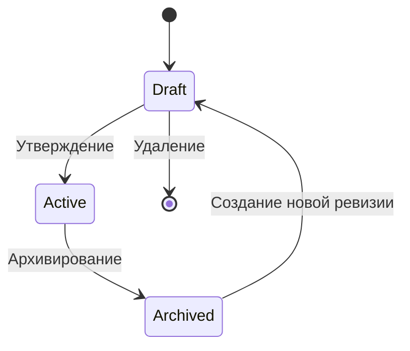

LIMS.DDD

## Жизненный цикл методики

## Бизнес-процессы

### Конфигурирование методики (п. 8.6.2 ГОСТ)

Загрузка методов испытаний, правил вычислений и спецификаций в базу данных ЛИМС является одним из наиболее трудоемких этапов внедрения системы.

Процесс конфигурирования включает следующие этапы:

1. Создание методики в статусе **Draft** с указанием наименования и ревизии.
2. Добавление входных параметров с алиасами, используемыми в формулах, и спецификациями.
3. Добавление определяемых показателей с единицами измерения и спецификациями.
4. Определение правил расчета с математическими формулами.
5. Привязка переменных формул к соответствующим входным параметрам.
6. Утверждение методики (переход из статуса **Draft** в **Active**).

---

### Частичное обновление структуры

Пока методика находится в статусе **Draft**, допускается изменение любых ее элементов.

Доступные операции:

- обновление параметров, показателей и правил расчета (**PATCH** с передачей только изменяемых полей);
- добавление новых элементов;
- удаление существующих элементов;
- изменение привязок переменных в формулах.

> После перевода методики в статус **Active** прямое изменение ее структуры запрещено.

---

### Контроль изменений (п. 8.7.9 ГОСТ)

Изменения в статических справочных данных контролируются посредством механизма статусов.

| Статус | Разрешенные действия |
|--------|----------------------|
| **Draft** | Свободное редактирование структуры методики |
| **Active** | Изменения возможны только через создание новой ревизии |
| **Archived** | Изменения возможны только через создание новой ревизии |

Каждое изменение статуса фиксируется в системе и подлежит аудиту.
