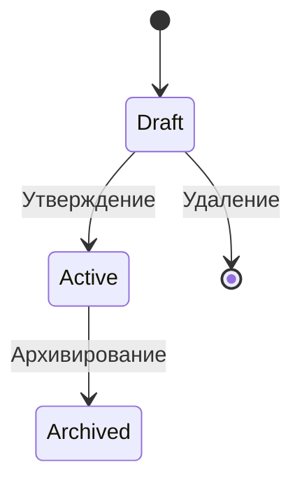
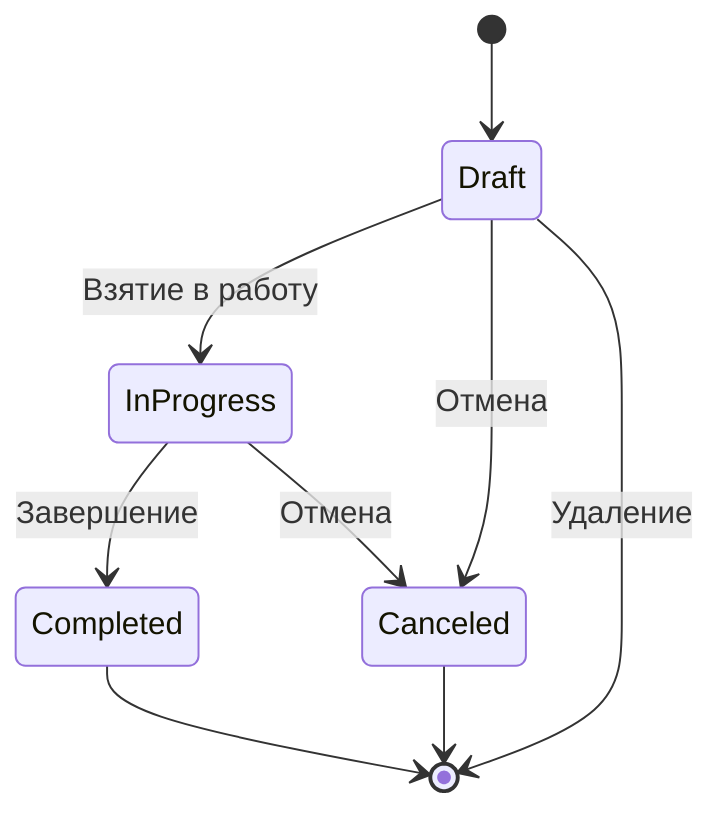
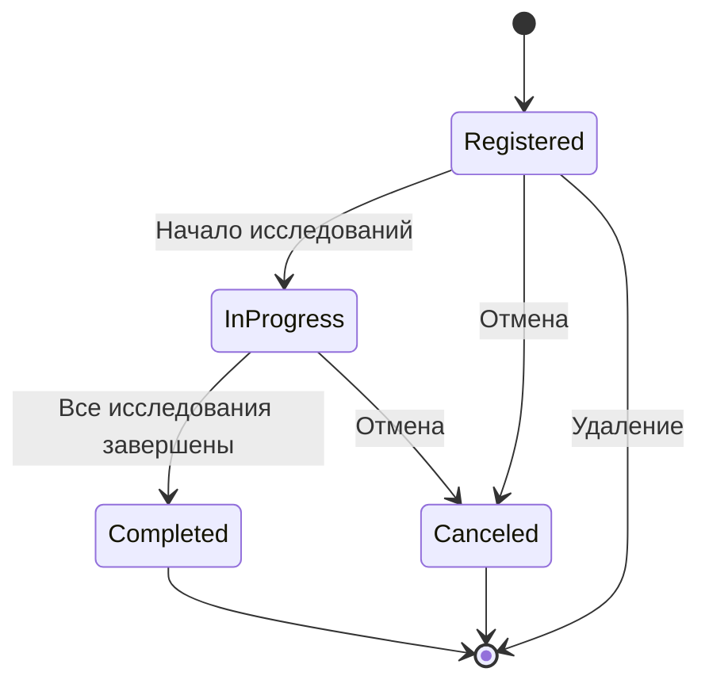
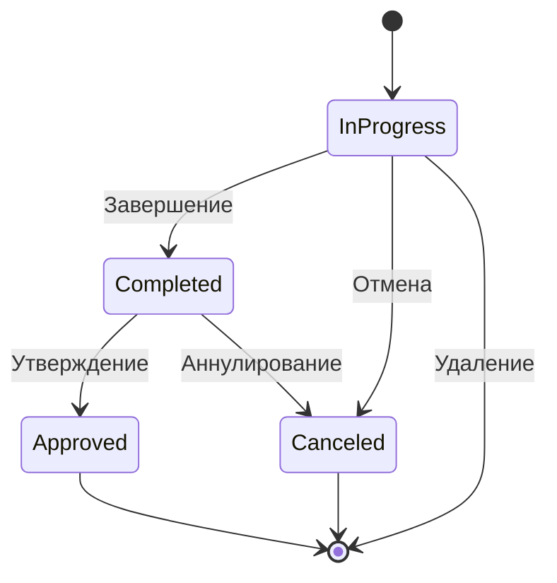
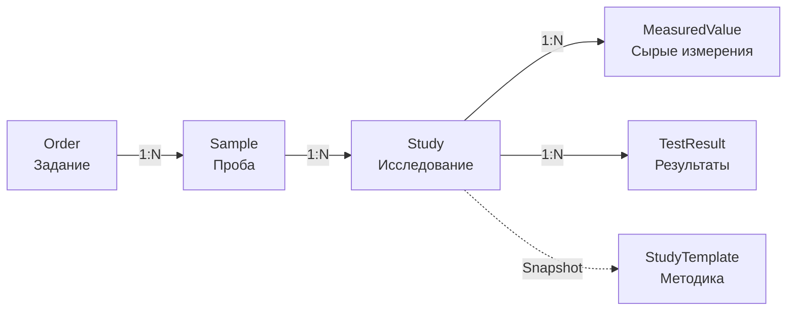
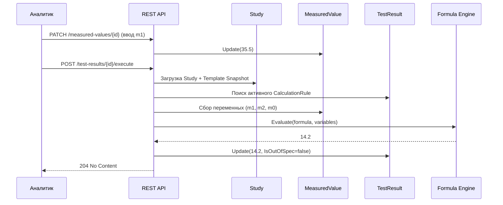

# LIMS.DDD

## Содержание

- [Жизненные циклы](#жизненные-циклы)
  - [Методика](#жизненный-цикл-методики)
  - [Задание (Order)](#жизненный-цикл-задания-order)
  - [Проба (Sample)](#жизненный-цикл-пробы-sample)
  - [Исследование (Study)](#жизненный-цикл-исследования-study)
- [Оркестрация лабораторного процесса](#оркестрация-лабораторного-процесса)
- [Бизнес-процессы](#бизнес-процессы)
  - [Сценарий создания](#сценарий-создания-п-631-гост)
  - [Конфигурирование методики](#конфигурирование-методики-п-862-гост)
  - [Частичное обновление структуры](#частичное-обновление-структуры)
  - [Контроль изменений](#контроль-изменений-п-879-гост)
  - [Движок расчетов](#движок-расчетов-п-6344-гост)
- [Архитектурные принципы](#архитектурные-принципы)

---

# Жизненные циклы

## Жизненный цикл методики

## Жизненный цикл Задания (Order)

## Жизненный цикл Пробы (Sample)

## Жизненный цикл Исследования (Study)

## Оркестрация лабораторного процесса

---

# Бизнес-процессы

## Сценарий создания (п. 6.3.1 ГОСТ)

1. **Регистрация Задания** — создание бизнес-обязательства перед заказчиком (договор/заявка).
2. **Регистрация Проб** — привязка физических образцов к заданию с указанием даты отбора, объема и кода.
3. **Создание Исследований** — автоматическая генерация "скелета" исследования на основе `StudyTemplateSnapshot`:
   1. Система создает `MeasuredValue` для каждого входного параметра методики.
   2. Система создает `TestResult` для каждого определяемого показателя.
   3. Исторические данные (имена, алиасы, спецификации) копируются в исследование, обеспечивая независимость от будущих изменений методики.

## Конфигурирование методики (п. 8.6.2 ГОСТ)

Загрузка методов испытаний, правил вычислений и спецификаций в базу данных ЛИМС является одним из наиболее трудоемких этапов внедрения системы.

Процесс конфигурирования включает следующие этапы:

1. Создание методики в статусе **Draft** с указанием наименования и ревизии.
2. Добавление входных параметров с алиасами, используемыми в формулах, и спецификациями.
3. Добавление определяемых показателей с единицами измерения и спецификациями.
4. Определение правил расчета с математическими формулами.
5. Привязка переменных формул к соответствующим входным параметрам.
6. Утверждение методики (переход из статуса **Draft** в **Active**).

---

## Частичное обновление структуры

Пока методика находится в статусе **Draft**, допускается изменение любых ее элементов.

**Доступные операции:**

- обновление параметров, показателей и правил расчета (**PATCH** с передачей только изменяемых полей);
- добавление новых элементов;
- удаление существующих элементов;
- изменение привязок переменных в формулах.

> После перевода методики в статус **Active** прямое изменение ее структуры запрещено.

---

## Контроль изменений (п. 8.7.9 ГОСТ)

Изменения в статических справочных данных контролируются посредством механизма статусов.

| Статус | Разрешенные действия |
|:---:|---|
| **Draft** | Свободное редактирование структуры методики |
| **Active** | Изменения возможны только через создание новой ревизии |
| **Archived** | Изменения возможны только через создание новой ревизии |

## Движок расчетов (п. 6.3.4.4 ГОСТ)

LIMS поддерживает автоматический расчет результатов по формулам, определенным в `StudyTemplate`.

### Определение выхода за спецификацию

Флаг `IsOutOfSpec` выставляется автоматически на основе сравнения рассчитанного значения с пределами `SpecMin` и `SpecMax`, сохраненными в `ResultSnapshot` на момент создания исследования.

---

# Архитектурные принципы

## 1. Разделение контекстов (Bounded Contexts)

- **StudyTemplateContext** — управление мастер-данными (методики, параметры, формулы).
- **LaboratoryOperationsContext** — управление транзакционными данными (задания, пробы, исследования).

Контексты взаимодействуют через Snapshot-паттерн: при создании Study структура методики копируется в транзакционные данные, что гарантирует историческую целостность и защиту от изменений мастер-данных задним числом.

## 2. Инкапсуляция бизнес-логики

- **Application Layer** выполняет только оркестрацию: загрузка агрегатов из репозиториев, вызов Domain Services, сохранение через `IUnitOfWork`.
- **Domain Layer** содержит все бизнес-правила: валидацию статусов, проверку инвариантов, генерацию дочерних сущностей.
- **Domain Services** отвечают за кросс-агрегатные операции, которые не могут быть инкапсулированы в одном агрегате.

## 3. Soft Delete для мастер-данных

Шаблоны методик (`StudyTemplate`) и их дочерние сущности не удаляются физически. Они помечаются флагом `IsDeleted = true`, что сохраняет аудиторский след и историческую целостность исследований.
