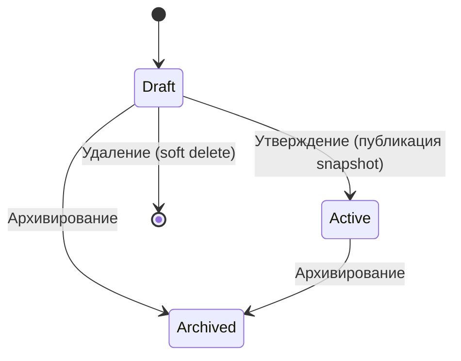
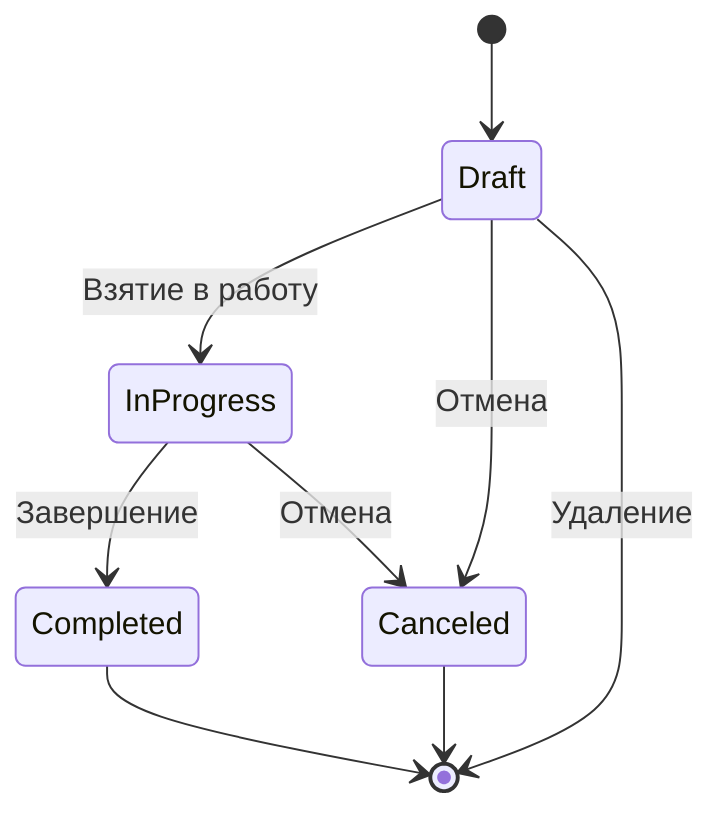
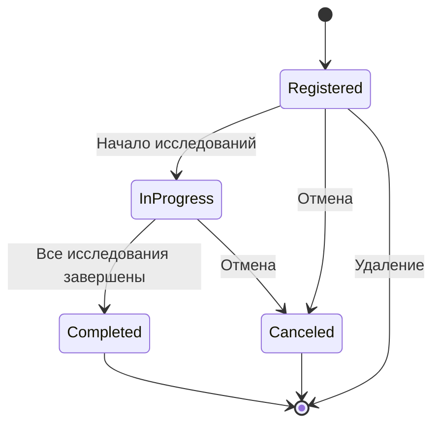
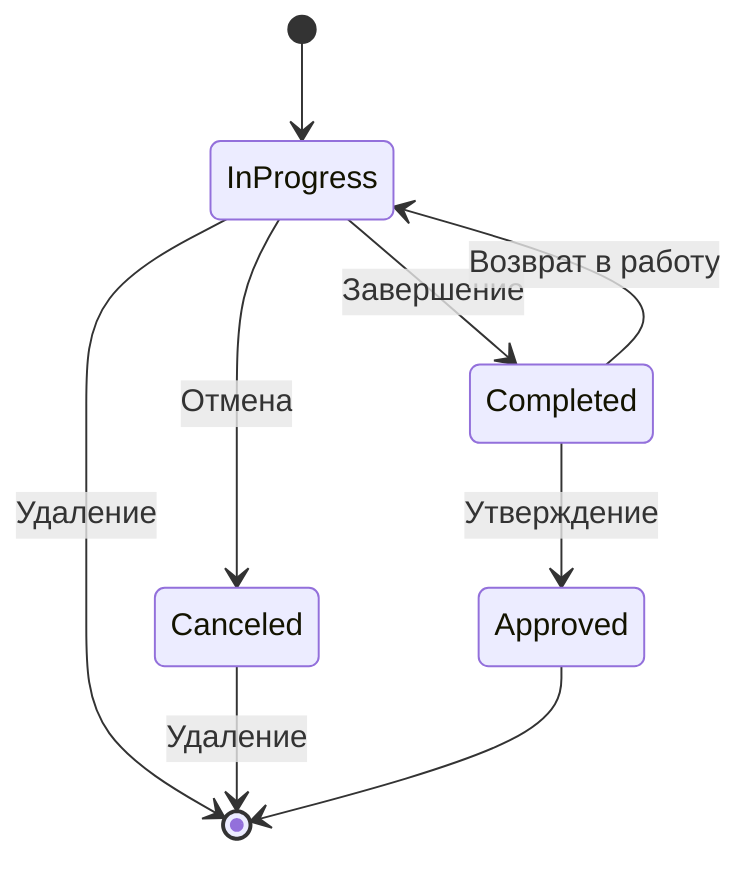
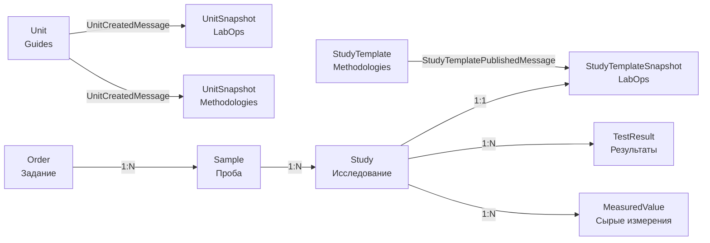
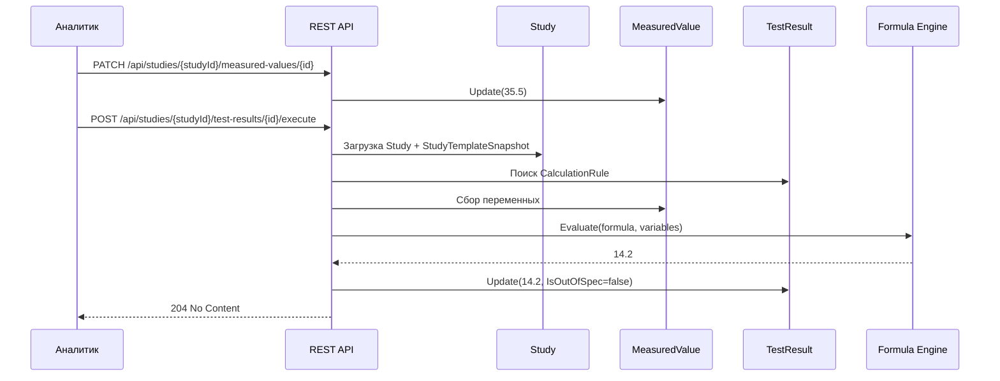
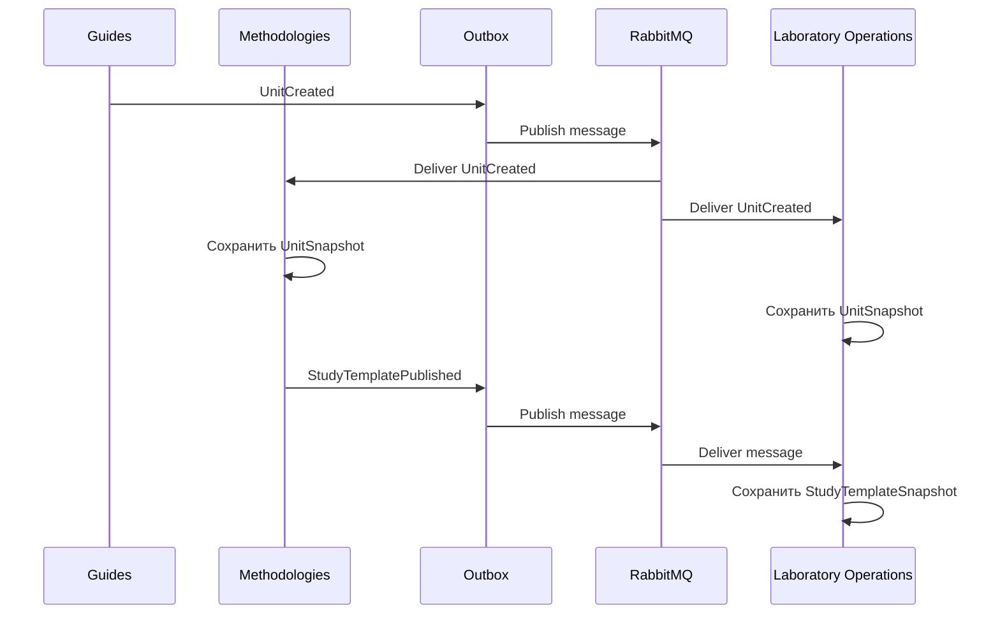

# LIMS.DDD


Учебный проект лабораторной информационной системы (LIMS), построенный вокруг **Domain-Driven Design**, **Clean Architecture** и микросервисного подхода.

Проект моделирует жизненный цикл лабораторных операций: от регистрации задания и проб до проведения исследований, ввода измерений и автоматического расчёта результатов.

> Проект находится в активной разработке и в первую очередь предназначен для изучения DDD, архитектурных паттернов, взаимодействия микросервисов и построения бизнес-ориентированной модели.

---

## Содержание

* [Архитектура](#архитектура)
* [Структура проекта](#структура-проекта)
* [Запуск проекта](#запуск-проекта)

  * [Требования](#требования)
  * [Запуск RabbitMQ](#запуск-rabbitmq)
  * [Настройка базы данных](#настройка-postgresql)
  * [Применение миграций](#применение-миграций)
  * [Запуск сервисов](#запуск-сервисов)
  * [Сервисы проекта](#сервисы-проекта)
* [Жизненные циклы](#жизненные-циклы)

  * [Методика](#жизненный-цикл-методики)
  * [Задание](#жизненный-цикл-задания-order)
  * [Проба](#жизненный-цикл-пробы-sample)
  * [Исследование](#жизненный-цикл-исследования-study)
* [Оркестрация лабораторного процесса](#оркестрация-лабораторного-процесса)
* [Бизнес-процессы](#бизнес-процессы)

  * [Сценарий создания](#сценарий-создания)
  * [Конфигурирование методики](#конфигурирование-методики)
  * [Частичное обновление структуры](#частичное-обновление-структуры)
  * [Контроль изменений](#контроль-изменений)
  * [Движок расчётов](#движок-расчётов)
* [Использованные архитектурные паттерны](#использованные-архитектурные-паттерны)
* [Архитектурные принципы](#архитектурные-принципы)
* [Технологии](#технологии)
* [Быстрый запуск](#быстрый-запуск)
* [Нормативная основа](#нормативная-основа)
* [Цель проекта](#цель-проекта)

---

# Архитектура

Проект разделён на несколько микросервисов и общих библиотек.

На текущий момент в репозитории присутствуют:

**Сервисы**

* **Guides.Service** — справочник единиц измерения (`Unit`). Публикует `UnitCreatedMessage`.
* **LIMS.Service.Methodologies** — управление методиками, параметрами, результатами и правилами расчёта. Публикует `StudyTemplatePublishedMessage`, потребляет `UnitCreatedMessage`.
* **LIMS.Service.LaboratoryOperations** — управление заданиями, пробами и исследованиями. Потребляет оба интеграционных события и хранит собственные snapshot-агрегаты.

**Общие библиотеки**

* `Library.Broker.RabbitMq` — инфраструктура RabbitMQ.
* `Library.Broker.Abstractions` — абстракции шины сообщений.
* `Library.Outbox` / `Library.Outbox.Abstractions` — переиспользуемая реализация Outbox Pattern.
* `Library.Broker.Messages` — контракты интеграционных сообщений.
* `Library.Application.SeedWork` и `Library.Domain.SeedWork` — общие примитивы Application и Domain слоёв.

Структура `src` отражает разделение каждого сервиса на отдельные Application, Domain, Infrastructure, Persistence и API проекты.

Каждый бизнес-контекст имеет собственный `ApplicationDbContext`, собственную базу PostgreSQL и собственный набор persistence-компонентов.

---

# Структура проекта

Каждый микросервис разделён по слоям:

```text
Guides.Service / LIMS.Service.Methodologies / LIMS.Service.LaboratoryOperations
│
├── API
├── Application
├── Domain
├── Infrastructure
└── Persistence
```

### API

Отвечает за транспортный слой:

* HTTP endpoints (Carter);
* HTTP request/response;
* DI composition;
* Swagger/OpenAPI.

### Application

Содержит application use cases:

* Commands;
* Queries;
* Handlers;
* orchestration;
* взаимодействие с репозиториями;
* Unit of Work.

Application Layer не содержит инфраструктурной реализации RabbitMQ, EF Core или других внешних механизмов.

### Domain

Содержит бизнес-модель:

* Aggregates;
* Entities;
* Value Objects;
* Domain Services;
* Domain Rules;
* Domain Errors.

Основная задача Domain Layer — поддерживать бизнес-инварианты независимо от способа доставки HTTP-запроса или хранения данных.

### Persistence

Отвечает за:

* EF Core;
* `ApplicationDbContext`;
* PostgreSQL;
* Repository implementations;
* Unit of Work;
* database configurations;
* migrations.

### Infrastructure

Содержит интеграции с внешними системами:

* RabbitMQ;
* integration events;
* message handlers;
* Outbox (Guides и Methodologies);
* другие инфраструктурные зависимости.

`LaboratoryOperations` в текущей версии только потребляет сообщения и не публикует собственные интеграционные события через Outbox.

---

# Запуск проекта

## Требования

Для запуска проекта необходимо установить:

* [.NET 10 SDK](https://dotnet.microsoft.com/download/dotnet/10.0)
* [Docker](https://www.docker.com/) (для RabbitMQ и при желании PostgreSQL)
* PostgreSQL
* Git
* [dotnet-ef](https://learn.microsoft.com/ef/core/cli/dotnet) для применения миграций

SDK зафиксирован в `global.json` (`10.0.0`, `rollForward: major`).

---

## 1. Клонирование репозитория

```bash
git clone https://github.com/SaintEfim/LIMS.DDD.git
cd LIMS.DDD
```

---

## 2. Запуск RabbitMQ

Для работы интеграционных событий необходимо запустить RabbitMQ.

Используется официальный Docker image с management UI:

```bash
docker run -it --rm --name rabbitmq -p 5672:5672 -p 15672:15672 rabbitmq:3-management
```

После запуска:

* AMQP: `localhost:5672`
* RabbitMQ Management UI: [http://localhost:15672](http://localhost:15672)

Для стандартной конфигурации контейнера:

```text
Username: guest
Password: guest
```

Сервисы подключаются к брокеру с этими значениями по умолчанию (`localhost:5672`, `guest` / `guest`).

---

## 3. Настройка PostgreSQL

Каждый бизнес-сервис использует собственную базу:

```text
Guides.Service.API
        ↓
ApplicationDbContext → GuidsDb

LIMS.Service.Methodologies.API
        ↓
ApplicationDbContext → MethodologiesDb

LIMS.Service.LaboratoryOperations.API
        ↓
ApplicationDbContext → LaboratoryOperationsDb
```

Строки подключения задаются в `appsettings.json` каждого API (`ConnectionStrings:ServiceDB`). Значения по умолчанию:

```text
Host=localhost; Username=postgres; Password=1234
```

Их нужно привести в соответствие с локальным PostgreSQL.

Пример запуска PostgreSQL в Docker:

```bash
docker run --name lims-postgres -e POSTGRES_PASSWORD=1234 -p 5432:5432 -d postgres:16
```

Базы создаются при применении миграций.

---

## 4. Применение миграций

Перед первым запуском необходимо применить EF Core migrations.

```bash
dotnet tool install --global dotnet-ef

dotnet ef database update --project src/LIMS.Service.Methodologies.Persistence --startup-project src/LIMS.Service.Methodologies.API

dotnet ef database update --project src/LIMS.Service.LaboratoryOperations.Persistence --startup-project src/LIMS.Service.LaboratoryOperations.API

dotnet ef database update --project src/Guides.Service.Persistence --startup-project src/Guides.Service.API
```

После этого каждая база будет приведена к актуальной схеме.

---

## 5. Запуск сервисов

После применения миграций запустите сервисы скриптом из корня репозитория:

```cmd
run-lims.cmd
```

Скрипт собирает и запускает:

* `Guides.Service.API` — [http://localhost:1003/swagger](http://localhost:1003/swagger)
* `LIMS.Service.Methodologies.API` — [http://localhost:1001/swagger](http://localhost:1001/swagger)
* `LIMS.Service.LaboratoryOperations.API` — [http://localhost:1002/swagger](http://localhost:1002/swagger)

Либо вручную:

```bash
dotnet run --project src/Guides.Service.API
dotnet run --project src/LIMS.Service.Methodologies.API
dotnet run --project src/LIMS.Service.LaboratoryOperations.API
```

> **Важно:** перед запуском должны быть доступны PostgreSQL и RabbitMQ.

---

# Сервисы проекта

## Guides.Service

Справочный сервис единиц измерения. Сейчас в домене есть агрегат `Unit`.

При создании единицы публикуется `UnitCreatedMessage`. Methodologies и LaboratoryOperations сохраняют у себя `UnitSnapshot`, чтобы не обращаться к базе Guides напрямую.

---

## LIMS.Service.Methodologies

Сервис отвечает за управление методиками испытаний.

Основные сущности:

```text
StudyTemplate
├── InputParameter
├── ResultDefinition
└── CalculationRule
```

Методика содержит:

* входные параметры;
* определяемые показатели;
* единицы измерения (через `UnitSnapshot`);
* спецификации;
* математические формулы;
* правила расчёта.

Persistence-слой сервиса использует собственный `ApplicationDbContext`, репозитории и Unit of Work.

---

## LIMS.Service.LaboratoryOperations

Сервис отвечает за транзакционные лабораторные операции:

```text
Order
└── Sample
    └── Study
        ├── MeasuredValue
        └── TestResult
```

Он работает независимо от контекста методик и справочника единиц, используя собственные snapshot-агрегаты:

* `StudyTemplateSnapshot` — снимок методики после публикации;
* `UnitSnapshot` — снимок единицы измерения после создания в Guides.

---

# Жизненные циклы

## Жизненный цикл методики



---

## Жизненный цикл Задания (Order)



---

## Жизненный цикл Пробы (Sample)



---

## Жизненный цикл Исследования (Study)



Удаление исследования запрещено в статусах `Completed` и `Approved`.

---

# Оркестрация лабораторного процесса

Основной бизнес-процесс строится следующим образом:



**Snapshot методики создаётся не в момент создания `Study`, а при публикации методики** (переход `Draft → Active`). В этот момент публикуется `StudyTemplatePublishedMessage`, которое доставляется в `LaboratoryOperations`, где формируется отдельный агрегат `StudyTemplateSnapshot`.

Когда создаётся `Study`, он использует **уже существующий** snapshot из собственного контекста `LaboratoryOperations`. Это позволяет исследованию оставаться неизменным с точки зрения применённой методики даже после появления новой ревизии `StudyTemplate`.

---

# Бизнес-процессы

## Сценарий создания (п. 6.3.1 ГОСТ)

1. **Регистрация Задания** — создание бизнес-обязательства перед заказчиком.
2. **Регистрация Проб** — привязка физических образцов к заданию с указанием даты отбора, объёма и кода.
3. **Создание Исследований** — автоматическая генерация структуры исследования на основе **уже существующего** `StudyTemplateSnapshot`:

   1. Создаются `MeasuredValue` для входных параметров.
   2. Создаются `TestResult` для определяемых показателей.
   3. Исторические данные методики копируются в исследование.

Таким образом, последующие изменения методики не изменяют уже созданные исследования.

---

## Конфигурирование методики (п. 8.6.2 ГОСТ)

Процесс конфигурирования методики:

1. Создание методики в статусе **Draft**.
2. Добавление входных параметров.
3. Добавление определяемых показателей.
4. Определение правил расчёта.
5. Привязка переменных формул к входным параметрам.
6. **Утверждение методики — переход `Draft → Active`**. В этот момент:
   * публикуется интеграционное событие `StudyTemplatePublishedMessage`;
   * `LaboratoryOperations` получает событие и создаёт собственный `StudyTemplateSnapshot`.

---

## Частичное обновление структуры

Пока методика находится в состоянии **Draft**, разрешено изменение её структуры.

Доступны:

* частичное обновление параметров;
* частичное обновление показателей;
* изменение правил расчёта;
* добавление элементов;
* удаление элементов;
* изменение связей между переменными и параметрами.

Для частичных изменений используется `PATCH`.

После перехода в `Active` прямое изменение структуры запрещено.

---

## Контроль изменений

Изменения мастер-данных контролируются через жизненный цикл методики.

|    Статус    | Изменение структуры |
| :----------: | :-----------------: |
|   **Draft**  |      Разрешено      |
|  **Active**  |      Запрещено      |
| **Archived** |      Запрещено      |

Для изменения `Active` или `Archived` методики должна создаваться новая ревизия.

---

# Движок расчётов

LIMS поддерживает автоматический расчёт результатов по формулам из `StudyTemplateSnapshot`. Вычисление выполняется библиотекой **NoStringEvaluating**.



## Определение выхода за спецификацию

После вычисления результата система сравнивает полученное значение с `SpecMin` и `SpecMax`, которые были сохранены в `StudyTemplateSnapshot` **в момент публикации методики** (а не в момент создания исследования).

На основании этого выставляется флаг `IsOutOfSpec`.

Таким образом, проверка выполняется относительно спецификации, актуальной на момент публикации методики. Последующие ревизии методики не влияют на уже созданные исследования.

---

# Использованные архитектурные паттерны

## Domain-Driven Design

Основная архитектурная концепция проекта.

Бизнес-модель разделена на:

* Aggregates;
* Entities;
* Value Objects;
* Domain Services;
* Domain Rules;
* Bounded Contexts.

DDD используется не только как структура папок, но и как способ моделирования бизнес-инвариантов лабораторного процесса.

---

## Bounded Context

Проект разделён на три бизнес-контекста:

```text
GuidesContext
        │
        │ UnitCreatedMessage
        │ (через RabbitMQ + Outbox)
        ▼
StudyTemplateContext (Methodologies)
        │
        │ StudyTemplatePublishedMessage
        │ (через RabbitMQ + Outbox)
        ▼
LaboratoryOperationsContext
        │
        │ сохраняет
        ▼
StudyTemplateSnapshot / UnitSnapshot
```

### GuidesContext

Отвечает за справочные данные:

* единицы измерения.

### StudyTemplateContext

Отвечает за мастер-данные:

* методики;
* параметры;
* результаты;
* формулы;
* спецификации;
* snapshots единиц измерения.

### LaboratoryOperationsContext

Отвечает за транзакционные данные:

* задания;
* пробы;
* исследования;
* измерения;
* результаты;
* snapshots методик и единиц измерения.

---

## Aggregate

Агрегаты используются для определения границ изменения данных и защиты инвариантов.

Например:

```text
StudyTemplate
├── InputParameters
├── ResultDefinitions
└── CalculationRules
```

Изменение структуры агрегата происходит через его публичное поведение, а не через произвольное изменение дочерних сущностей из Application Layer.

---

## Repository Pattern

Репозитории используются для получения и сохранения Aggregate Roots.

Application Layer работает с абстракциями:

```text
IStudyRepository
IStudyTemplateRepository
IOrderRepository
ISampleRepository
IUnitRepository
```

Конкретная реализация находится в Persistence Layer.

---

## Unit of Work

`UnitOfWork` используется как граница сохранения изменений.

Application Layer:

```text
Load Aggregate
      ↓
Execute business operation
      ↓
UnitOfWork
      ↓
SaveChanges
```

Это позволяет объединять изменения нескольких сущностей в одну транзакцию базы данных.

---

## Domain Services

Domain Services используются для бизнес-операций, которые не принадлежат естественным образом одному Aggregate.

Например, когда бизнес-правило требует координации нескольких агрегатов (валидация перехода статуса `Order` с учётом статуса всех дочерних `Sample`, проверка возможности создания `Study` по текущему статусу `Order` и `Sample`).

При этом Application Layer отвечает за orchestration, а само бизнес-правило остаётся в Domain Layer.

---

## Snapshot Pattern

Один из ключевых паттернов проекта.

Snapshot методики создаётся **при публикации** (`Draft → Active`), а не при создании исследования:

```text
StudyTemplate v1 (Methodologies)
      │
      │ Draft → Active
      │ публикуется StudyTemplatePublishedMessage
      ▼
RabbitMQ (через Outbox)
      │
      │ доставляется в LaboratoryOperations
      ▼
StudyTemplateSnapshot (отдельный агрегат в LabOps)
      │
      │ используется при создании
      ▼
Study
```

Аналогично `Unit` из Guides проецируется в `UnitSnapshot` в Methodologies и LaboratoryOperations.

Это позволяет:

* сохранять историческое состояние методики;
* не зависеть от последующих изменений мастер-данных;
* воспроизводить результаты исследований;
* обеспечивать аудит применённой методики;
* полностью развязать bounded contexts (они не обращаются к БД друг друга).

---

## Outbox Pattern

Для надёжной публикации интеграционных событий используется **Transactional Outbox**.

Вместо:

```text
Database
   ↓
RabbitMQ
```

используется:

```text
┌───────────────────────────┐
│       DB Transaction      │
│                           │
│  Business Entity          │
│  OutboxMessage            │
│                           │
└─────────────┬─────────────┘
              │ COMMIT
              ▼
       Outbox Processor
              │
              ▼
          RabbitMQ
```

Бизнес-изменение и `OutboxMessage` сохраняются в одной транзакции.

После успешного commit фоновый worker публикует сообщение в RabbitMQ. Если брокер недоступен — сообщение остаётся в таблице и будет отправлено при следующей итерации.

Outbox вынесен в переиспользуемую библиотеку и может работать с разными `DbContext`. Сейчас Outbox подключён в **Guides** и **Methodologies**. LaboratoryOperations в текущей версии только потребляет события.

---

## Integration Events

Для коммуникации между микросервисами используются интеграционные события из `Library.Broker.Messages`:

```text
StudyTemplatePublishedMessage
UnitCreatedMessage
```

Сервис-источник:

```text
Domain/Application
       ↓
Outbox
       ↓
RabbitMQ
```

Сервис-получатель:

```text
RabbitMQ
       ↓
Message Handler
       ↓
Application
       ↓
Сохранение snapshot
```

Таким образом, бизнес-контексты не должны напрямую обращаться к базам данных друг друга.

---

## Asynchronous Messaging

RabbitMQ используется для асинхронного взаимодействия между сервисами.

Это позволяет отделить:

```text
Producer
   │
   ▼
Message Broker
   │
   ▼
Consumer
```

и уменьшить связанность между микросервисами.

RabbitMQ инфраструктура вынесена в отдельные библиотеки:

```text
Library.Broker.RabbitMq
Library.Broker.Abstractions
Library.Outbox
Library.Outbox.Abstractions
Library.Broker.Messages
```

---

## Event-Driven Architecture

Интеграционные события используются для уведомления других bounded contexts о произошедших изменениях.



При этом RabbitMQ не участвует в основной транзакции бизнес-операции.

---

## State Machine

Управление жизненным циклом агрегатов реализовано через State Machine Pattern. Каждый статус (`Draft`, `Active`, `Archived`, `InProgress`, `Completed` и т.д.) определяет:

* допустимые переходы (`CanTransitionTo`);
* возможность редактирования (`CanEdit`).

Правила переходов инкапсулированы в классах состояний. Возможность создавать дочерние сущности (`CanAcceptNewEntity`) и удалять связанные сущности (`CanDeleteAssociatedEntities`) проверяется на агрегатах `Order` и `Sample` на основании текущего статуса.

---

## Result Pattern

Вместо исключений для управления потоком ошибок используется `Result<TValue, TError>` — явное представление успеха или неудачи.

Пример из домена:

```csharp
public static Result<Name, DomainError> Create(string value)
{
    if (string.IsNullOrWhiteSpace(value))
        return new ValidationError("Name cannot be empty.");

    if (value.Length > MaxNameLength)
        return new ValidationError(
            $"Name length cannot exceed {MaxNameLength} characters. Current length: {value.Length}.");

    return new Name(value.Trim());
}
```

**Преимущества:**

* Явная сигнатура метода показывает возможные ошибки;
* Компилятор контролирует обработку ошибок;
* Отсутствие исключений для ожидаемых сценариев;
* Легко комбинировать через LINQ-подобные операции.

---

## Двухуровневая модель ошибок

В проекте используются два уровня ошибок для чёткого разделения ответственности.

### Domain Errors

Ошибки бизнес-логики в доменном слое (`Library.Domain.SeedWork.Errors`). `DomainError` наследуется от `Exception` и содержит `Code` / `Message`.

Примеры: `EntityNotFoundError`, `EntityAlreadyDeletedError`, `InvalidStatusTransitionError`, `EntityNotEditableError`, `EntityInUseError`, `DuplicateEntityError`, `ValidationError`.

### Application Errors

Ошибки application-слоя (`Library.Application.SeedWork.Errors`) оборачивают доменные ошибки или представляют инфраструктурные проблемы. `ApplicationError` также наследуется от `Exception`:

```csharp
public abstract class ApplicationError : Exception;

public sealed class DomainRuleViolation(DomainError error) : ApplicationError;
public sealed class NotFoundError(string Message) : ApplicationError;
public sealed class ValidationError(string Message) : ApplicationError;
public sealed class PersistenceError(string Message) : ApplicationError;
```

API-слой (например, `ModuleBase` в Methodologies) маппит ошибки на HTTP-статусы:

| Тип ошибки | HTTP статус |
|------------|-------------|
| `NotFoundError` / `EntityNotFoundError` / `EntityAlreadyDeletedError` | 404 Not Found |
| `ValidationError` | 400 Bad Request |
| `InvalidStatusTransitionError` / `EntityNotEditableError` / `EntityInUseError` / `DuplicateEntityError` | 409 Conflict |
| `PersistenceError` | 500 Internal Server Error |

---

## Soft Delete

Для мастер-данных и операционных агрегатов используется Soft Delete:

```text
IsDeleted = true
DeletedAt = DateTimeOffset.UtcNow
```

Физическое удаление не производится, что позволяет:

* сохранять историю;
* поддерживать аудит;
* не нарушать историческую целостность связанных данных.

При удалении агрегата каскадно помечаются удалёнными все его дочерние сущности.

---

## Optimistic Concurrency

При изменении данных используется подход, позволяющий обнаруживать конфликтующие изменения и не допускать незаметного перезаписывания данных другим запросом.

---

# Архитектурные принципы

## 1. Разделение контекстов

```text
GuidesContext
        │ UnitCreatedMessage
        ▼
StudyTemplateContext (Methodologies)
        │ StudyTemplatePublishedMessage
        ▼
LaboratoryOperationsContext
```

Контексты имеют собственные модели и базы данных.

Они не используют прямые EF Core relationships между агрегатами разных bounded contexts.

---

## 2. Инкапсуляция бизнес-логики

### Application Layer

Отвечает за orchestration:

* загрузку Aggregate;
* вызов бизнес-операций;
* координацию use case;
* Unit of Work.

### Domain Layer

Отвечает за:

* бизнес-правила;
* инварианты;
* переходы состояний;
* создание дочерних сущностей;
* Domain Services.

### Infrastructure / Persistence

Отвечают за технические детали:

* PostgreSQL;
* EF Core;
* RabbitMQ;
* Outbox;
* внешние интеграции.

---

## 3. Dependency Inversion

Application и Domain не должны зависеть от конкретных инфраструктурных реализаций.

Например:

```text
Application
     │
     ▼
IStudyRepository
     ▲
     │
Persistence
```

А не:

```text
Application
     │
     ▼
StudyRepository
     │
     ▼
EF Core
```

---

## 4. Transactional Boundaries

Изменение бизнес-сущности и соответствующего Outbox-сообщения выполняется в рамках одной транзакции:

```text
BEGIN
   │
   ├── Update business data
   │
   ├── Insert OutboxMessage
   │
COMMIT
```

После commit Outbox worker независимо от HTTP-запроса доставляет интеграционное событие в брокер.

---

# Технологии

| Технология                   | Назначение                        |
| ---------------------------- | --------------------------------- |
| **C# / .NET 10**             | Основной runtime                  |
| **ASP.NET Core**             | REST API                          |
| **Entity Framework Core 10** | ORM                               |
| **PostgreSQL**               | Хранение данных                   |
| **RabbitMQ**                 | Message Broker                    |
| **Docker**                   | Инфраструктура                    |
| **Carter**                   | Организация Minimal API endpoints |
| **NoStringEvaluating**       | Движок формул                     |
| **Swagger / OpenAPI**        | API documentation                 |
| **Mermaid**                  | Архитектурные и бизнес-диаграммы  |
| **Git**                      | Version Control                   |

---

# Быстрый запуск

Если окружение уже настроено, последовательность запуска выглядит следующим образом:

```bash
# 1. Клонировать
git clone https://github.com/SaintEfim/LIMS.DDD.git
cd LIMS.DDD
```

```bash
# 2. Запустить RabbitMQ
docker run -it --rm --name rabbitmq -p 5672:5672 -p 15672:15672 rabbitmq:3-management
```

```bash
# 3. Применить миграции
dotnet ef database update --project src/LIMS.Service.Methodologies.Persistence --startup-project src/LIMS.Service.Methodologies.API
dotnet ef database update --project src/LIMS.Service.LaboratoryOperations.Persistence --startup-project src/LIMS.Service.LaboratoryOperations.API
dotnet ef database update --project src/Guides.Service.Persistence --startup-project src/Guides.Service.API
```

Затем:

```cmd
run-lims.cmd
```

После этого должны быть запущены:

```text
Guides.Service.API                     http://localhost:1003
LIMS.Service.Methodologies.API         http://localhost:1001
LIMS.Service.LaboratoryOperations.API  http://localhost:1002
```

И RabbitMQ:

```text
AMQP:       localhost:5672
Management: localhost:15672
```

## Демонстрационный сценарий

Файл [`LIMS.http`](./LIMS.http) содержит последовательность запросов, которая демонстрирует полный жизненный цикл лабораторного процесса на примере определения влажности зерна — от настройки методики до завершения исследования.

### Порядок выполнения

1. **Создание единиц измерения**

   Регистрируются единицы измерения, необходимые для работы с методикой:
   - `г` — грамм;
   - `%` — процент.

   После создания нужно дождаться доставки `UnitCreatedMessage` и появления `UnitSnapshot` в остальных сервисах.

2. **Создание методики**

   Создаётся методика определения влажности зерна.

   В методике определяются три входных параметра:
   - `m1` — масса бюксы с зерном до высушивания;
   - `m2` — масса бюксы с зерном после высушивания;
   - `m0` — масса пустой бюксы.

3. **Определение показателей**

   В методику добавляются определяемые показатели:
   - **Вода**;
   - **Сухое вещество**.

   Для показателей задаются единицы измерения и допустимые диапазоны значений.

4. **Настройка правила расчёта**

   Для определения содержания воды задаётся формула:

   ```text
   ((m1 - m2) / (m1 - m0)) * 100
   ```

   Переменные формулы связываются с соответствующими входными параметрами методики.

5. **Утверждение методики**

   Методика переводится из состояния **Draft** в **Active**.

   После утверждения её структура становится неизменяемой. Для дальнейших изменений необходимо создать новую ревизию.

6. **Создание новой ревизии**

   Создаётся новая ревизия методики, демонстрируя механизм версионирования и контроля изменений.

7. **Регистрация задания**

   Создаётся лабораторное задание на проведение исследования.

8. **Регистрация пробы**

   В рамках задания регистрируется проба зерна с необходимыми характеристиками.

9. **Создание исследования**

   Для зарегистрированной пробы создаётся исследование с использованием утверждённой методики.

   В исследовании формируется набор входных измерений и определяемых показателей, соответствующий выбранной методике.

10. **Ввод результатов измерений**

    В исследование вносятся фактические значения:

    * `m1` — масса бюксы с зерном до высушивания;
    * `m2` — масса бюксы с зерном после высушивания;
    * `m0` — масса пустой бюксы.

11. **Расчёт результатов**

    На основании введённых измерений рассчитывается содержание воды в зерне.

    Полученное значение сравнивается с допустимой спецификацией, после чего определяется, находится ли результат в пределах нормы.

12. **Завершение исследования**

    После выполнения всех необходимых операций исследование переводится в состояние **Completed**.

---

# Нормативная основа

Предметная область и основные бизнес-процессы проекта моделировались с опорой на:

**ГОСТ Р 53798-2010
«Стандартное руководство по лабораторным информационным менеджмент-системам (ЛИМС)».**

ГОСТ используется как источник требований при моделировании жизненных циклов, процессов работы с заданиями, пробами, исследованиями, методиками и результатами.

При этом архитектура приложения является самостоятельной разработкой и включает DDD, Bounded Contexts, Aggregates, Snapshot Pattern, Transactional Outbox и событийное взаимодействие между контекстами.

# Цель проекта

Основная цель проекта — не создание production-ready LIMS, а практическое исследование того, как можно моделировать сложную предметную область с использованием:

* **Domain-Driven Design**
* **Bounded Contexts**
* **Aggregates**
* **Domain Services**
* **Repository Pattern**
* **Unit of Work**
* **Snapshot Pattern**
* **Transactional Outbox**
* **Integration Events**
* **RabbitMQ**
* **Clean Architecture**
* **Microservices**
* **Event-Driven Architecture**
* **Result Pattern**
* **State Machine**

Проект постепенно развивается в сторону более полноценной распределённой архитектуры, где каждый bounded context обладает собственной моделью данных и отвечает за собственную бизнес-область.
